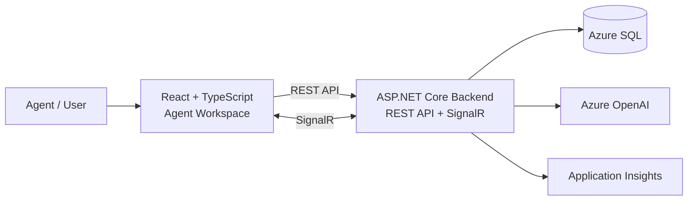

# OmniDesk

OmniDesk is a multi-tenant customer engagement and agent workspace platform built with ASP.NET Core, React, SQL Server, SignalR, and Azure.

The project is designed as a modular monolith with clear application boundaries, tenant isolation, realtime conversation updates, and AI-assisted agent workflows.

---

## Architecture



For backend project structure, deployment architecture, and architecture decisions, see:

[View detailed architecture](docs/architecture.md)

---

## Tech Stack

### Backend

- C#
- .NET 10
- ASP.NET Core
- Entity Framework Core
- SQL Server
- JWT Authentication
- SignalR

### Frontend

- React
- TypeScript
- Vite

### Cloud & DevOps

- Docker
- GitHub Actions
- Azure Container Apps
- Azure Container Registry
- Azure SQL
- Azure OpenAI
- Application Insights
- Azure Key Vault

### Testing

- xUnit
- Unit testing
- Integration testing

---

## Core Capabilities

OmniDesk is designed around the following business capabilities:

- Tenant registration
- User authentication and authorization
- Multi-tenant data isolation
- Customer management
- Conversation management
- Message history
- Agent message sending
- Conversation status management
- Realtime updates with SignalR
- AI-assisted conversation summary

---

## Backend Structure

```text
src/
├── OmniDesk.Api/
├── OmniDesk.Application/
├── OmniDesk.Domain/
└── OmniDesk.Infrastructure/
```

The backend follows a simplified Clean Architecture approach:

| Project | Responsibility |
|---|---|
| `OmniDesk.Domain` | Core business entities and rules |
| `OmniDesk.Application` | Use cases, application logic, and abstractions |
| `OmniDesk.Infrastructure` | Persistence, external services, and technical implementations |
| `OmniDesk.Api` | HTTP, SignalR, host configuration, and dependency composition |

---

## Repository Structure

```text
OmniDesk/
├── README.md
├── docs/
│   └── architecture.md
├── src/
│   ├── OmniDesk.Api/
│   ├── OmniDesk.Application/
│   ├── OmniDesk.Domain/
│   └── OmniDesk.Infrastructure/
└── tests/
```

---

## Architecture Principles

- Modular monolith instead of premature microservices
- Clear separation between domain, application, infrastructure, and transport concerns
- Tenant isolation treated as a security boundary
- SQL Server as the primary relational data store
- SignalR used for realtime transport
- AI treated as an external capability rather than authoritative business state
- Containerized deployment with automated CI/CD

---

## Development Status

OmniDesk is currently under active development.

Current focus:

- Backend architecture cleanup
- Conversation and message workflow
- React agent workspace integration
- AI conversation summary
- Automated testing
- Docker and Azure deployment
- CI/CD and observability

---

## Documentation

- [Architecture](docs/architecture.md)

Additional documentation such as the database ERD will be added as the design is finalized.
