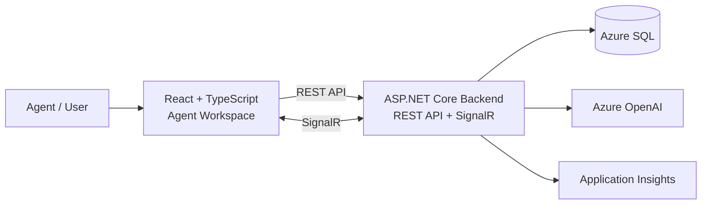
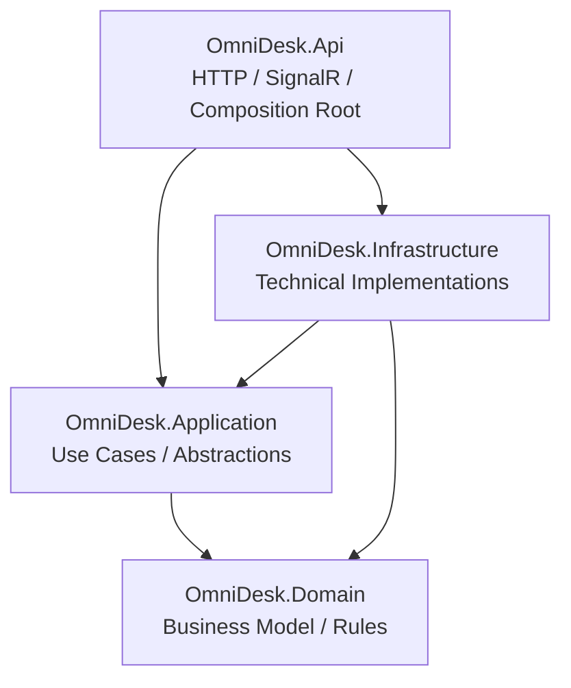
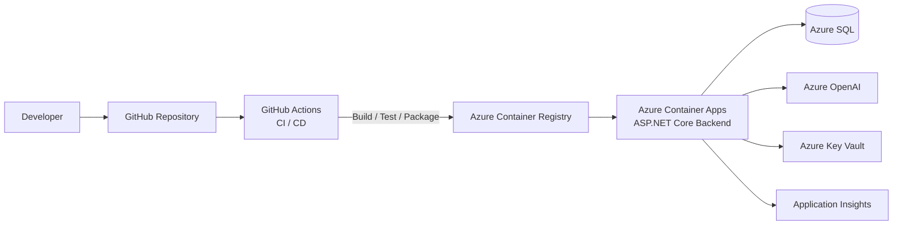

# OmniDesk Architecture

OmniDesk is a multi-tenant customer engagement and agent workspace platform.

This document describes the target system architecture and the main architectural decisions that guide implementation.

---

## 1. Architecture Goals

- Keep the system as a modular monolith with clear internal boundaries.
- Separate business logic from infrastructure and transport concerns.
- Enforce multi-tenant data isolation.
- Support realtime conversation updates.
- Keep AI capabilities isolated from core business logic.
- Support containerized deployment to Azure.
- Avoid unnecessary distributed-system complexity.

---

## 2. System Overview

The frontend communicates with the ASP.NET Core backend through REST APIs and SignalR.  
The backend owns the application logic and integrates with Azure SQL, Azure OpenAI, and Application Insights.

---

## 3. Backend Project Architecture

The backend follows a simplified Clean Architecture structure.

> Arrows represent compile-time project dependencies.

| Project | Responsibility |
|---|---|
| `OmniDesk.Domain` | Core business entities and business rules |
| `OmniDesk.Application` | Use cases, application logic, and abstractions |
| `OmniDesk.Infrastructure` | Persistence, external services, and other technical implementations |
| `OmniDesk.Api` | HTTP, SignalR, host configuration, and dependency composition |

Business features such as Identity, Customers, Conversations, and AI are organized as folders inside these projects rather than as separately deployed services.

---

## 4. Deployment Architecture

The target deployment uses containers and Azure-managed services.

---

## 5. Key Architecture Decisions

### Modular Monolith

OmniDesk starts as a modular monolith because the current scale and team size do not justify the operational complexity of microservices.

Clear internal boundaries are maintained so modules can be extracted later if independent deployment or scaling becomes necessary.

### Relational Database

SQL Server is used because the core domain is relational and requires transactional consistency.

Azure SQL is the target managed production database.

### Realtime Communication

SignalR is used for realtime conversation updates between the backend and React clients.

Business logic remains independent of the realtime transport mechanism.

### AI Integration

AI is treated as an external capability rather than part of the core domain.

AI-generated output is advisory and does not own authoritative business state.

### Multi-Tenancy

Tenant boundaries are treated as a security boundary across business data access.

All tenant-owned data must remain isolated between tenants.
